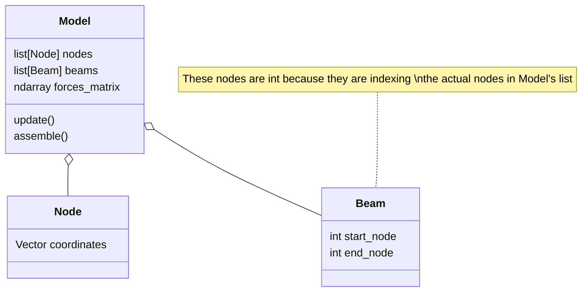
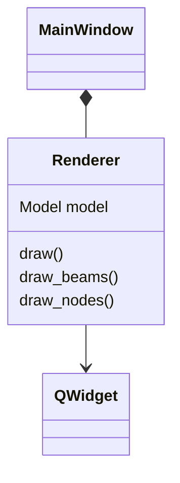

# Model diagram

```mermaid
classDiagram

Model o-- Node
Model o-- Beam

class Node {
  Vector coordinates
}

note for Beam "These nodes are int because they are indexing \nthe actual nodes in Model's list"

class Beam {
  int start_node
  int end_node
}

class Model {
  list[Node] nodes
  list[Beam] beams
  ndarray forces_matrix
  
  update()
  assemble()
}
```

# Interface diagram

```mermaid
classDiagram 

Renderer --> QWidget
MainWindow *-- Renderer

class Renderer {
  Model model
  
  draw()
  draw_beams()
  draw_nodes()
}
```
